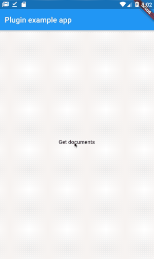
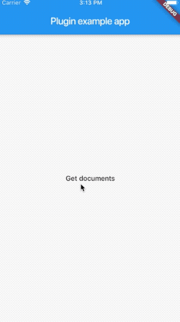

# Documents Picker

[](https://pub.dartlang.org/packages/documents_picker)

A Flutter plugin for IOS and Android providing a simple way to get documents from local storage or ICloud.

## Features:

* Get documents from local storage.
* Download documents from ICloud (Just for IOS).

 ........... 

## Installation

First, add `documents_picker` as a [dependency in your pubspec.yaml file](https://flutter.io/using-packages/).

### Android

You need to add these styles to the android app (app/src/main/values/styles.xml).

```sh
  <style name="LibAppTheme" parent="Theme.AppCompat.Light.NoActionBar">
      <!-- Customize your theme here. -->
      <item name="colorPrimary">@color/colorPrimary</item>
      <item name="colorPrimaryDark">@color/colorPrimaryDark</item>
      <item name="colorAccent">@color/colorAccent</item>
      <item name="android:colorBackground">@android:color/background_light</item>
      <item name="android:windowBackground">@android:color/white</item>
  </style>

  <style name="PickerTabLayout" parent="Widget.Design.TabLayout">
      <item name="tabBackground">@color/colorPrimary</item>
      <item name="tabGravity">fill</item>
      <item name="tabMaxWidth">0dp</item>
  </style>

  <style name="SmoothCheckBoxStyle">
      <item name="color_checked">@color/checkbox_color</item>
      <item name="color_unchecked">@android:color/white</item>
      <item name="color_unchecked_stroke">@color/checkbox_unchecked_color</item>
      <item name="color_tick">@android:color/white</item>
  </style>
```
  
### Example

Here is an example flutter app displaying the getDocuments method.

```dart
import 'package:flutter/material.dart';
import 'package:flutter/services.dart';
import 'package:documents_picker/documents_picker.dart';

void main() => runApp(MyApp());

class MyApp extends StatefulWidget {
  @override
  _MyAppState createState() => _MyAppState();
}

class _MyAppState extends State<MyApp> {
  List<String> docPaths;

  void _getDocuments() async {
    docPaths = await DocumentsPicker.pickDocuments;

    if (!mounted) return;
    setState(() {});
  }

  @override
  Widget build(BuildContext context) {
    return MaterialApp(
      home: Scaffold(
        appBar: AppBar(
          title: Text('Plugin example app'),
        ),
        body: Center(
          child: Column(
            mainAxisAlignment: MainAxisAlignment.center,
            crossAxisAlignment: CrossAxisAlignment.center,
            children: <Widget>[
              FlatButton(
                child: Text('Get documents'),
                onPressed: _getDocuments,
              ),
              if (docPaths != null)
                Text(docPaths.join('\n'))
            ],
          ),
        ),
      ),
    );
  }
}
```

[Feedback welcome](https://github.com/lubritto/Flutter_Documents_Picker/issues) and
[Pull Requests](https://github.com/lubritto/Flutter_Documents_Picker/pulls) are most welcome!
